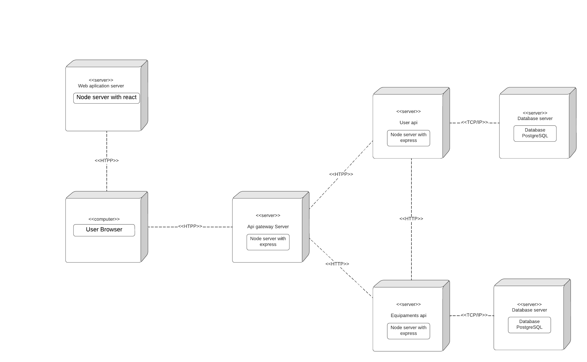
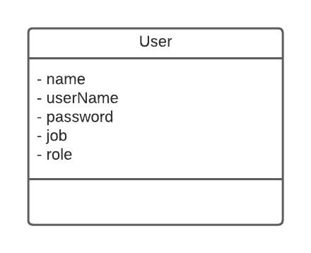
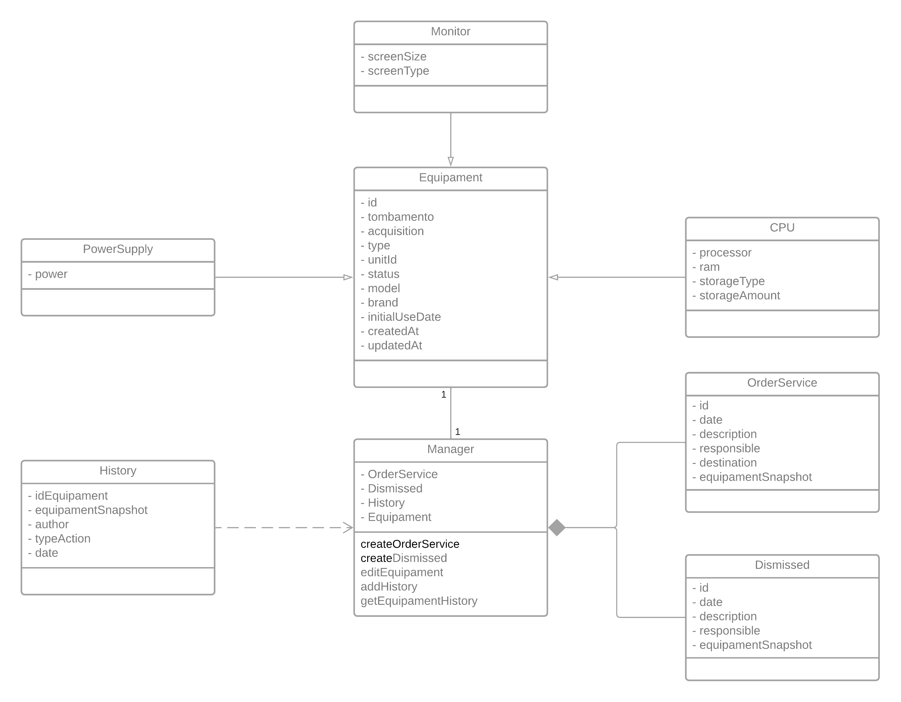

# Documento de Arquitetura

## 1. Introdução

### 1.1 Proposta

Este documento tem como principal objetivo elucidar as principais caracteristicas da arquitetura proposta para o software Alectrion, utilizando diferentes visões arquiteturais para destacar diferentes aspectos do sistema. Deste modo facilitando a entendimento da arquiterua para os desenvolvedores; 

### 1.2 Visão geral

O Documento de Arquitetura de Software, trata-se de uma visão geral de toda a arquitetura do sistema. Neste documento serão abordadas as seguintes visões da aplicação:

## 2. Representação arquitetural

### 2.1 Microserviços

Microserviço consiste em uma abordagem arquitetural a qual uma aplicação é compostas por serviçoes menores, que são impĺementados de forma idependente com acoplamento fraco. Esses serviçoes idependentes podemamlmente se comunicam entre usando API e são organizados por recurso de negócios. 

A arquitetura de microserviço acelera o desenvolvimento e tambem facilita a escalabilidade de uma aplicação. Este padrão arquitetural é utilizado na aplicação.
### 2.2 React

React é uma biblioteca JavaScript declarativa, eficiente e flexível para a criação de interfaces de usuário (UI). O react será utilizado para a criação do frontend, na interação com o usuário.

### 2.3 Nodejs
Nodejs é um ambiente de execução Javascript, multiplataforma e de código aberto,
possui foco em aplicações web e do lado do servidor.

### 2.4 Express
Express é um framework desenvolvido para aplicações web do Nodejs, mínimo e flexível que fornece um conjunto robusto de recursos para aplicativos web e móvel, que será para a criação de nossas apis.

### 2.5 PostgreSQL
Sistema gerenciador de banco de dados relacional, de código aberto que será utilizado para gerenciar os dados das aplicações.

### 2.6 Diagrama de relações

Frontend - Responsável pela interface visual do projeto, com o objetivo de prover as interações com os usuários.

Microserviço Gateway - Será responsável por ser o único ponto de entrada do usuário com os demais serviços do projeto, provendo autenticação e autorização.

Microserviço Usuário - Microserviço responsável pelo gerenciamento de usuários da aplicação 

Microserviço Equipamento -  Microserviço responsável pelo gerenciamento dos equipamentos da aplicação 

Banco de Dados Usuário - Responsável por armazenar os dados dos usuários.

Banco de Dados Equipamentos - Responsável por armazenar os dados dos equipamentos.

## 3. Visão Logica

### 3.1 Diagrama de pacotes 

### 3.2 Diagrama de implantação

### 3.3 Microserviço de usuário

### 3.3 Microserviço de equipamentos

## 4. Referências Bibliográficas

> [1] Microserviço. Disponivel em: https://www.ibm.com/br-pt/cloud/learn/microservices

> [2] React. Disponivel em: https://pt-br.reactjs.org/

> [3] Node Js. Disponivel em: https://developer.oracle.com/nodejs/what-is-node-js/

> [4] ExpressJs. Disponivel em: https://expressjs.com/pt-br/
## 5. Histórico da revisão

|**Data**|**Descrição**|**Autor(es)**|
|--------|-------------|-------------|
|17/07/2022|Criação do documento| João Pedro Soares e Matheus Estanislau |
|31/07/2022|Adição diagrama de classes| João Pedro Soares e Matheus Estanislau|
