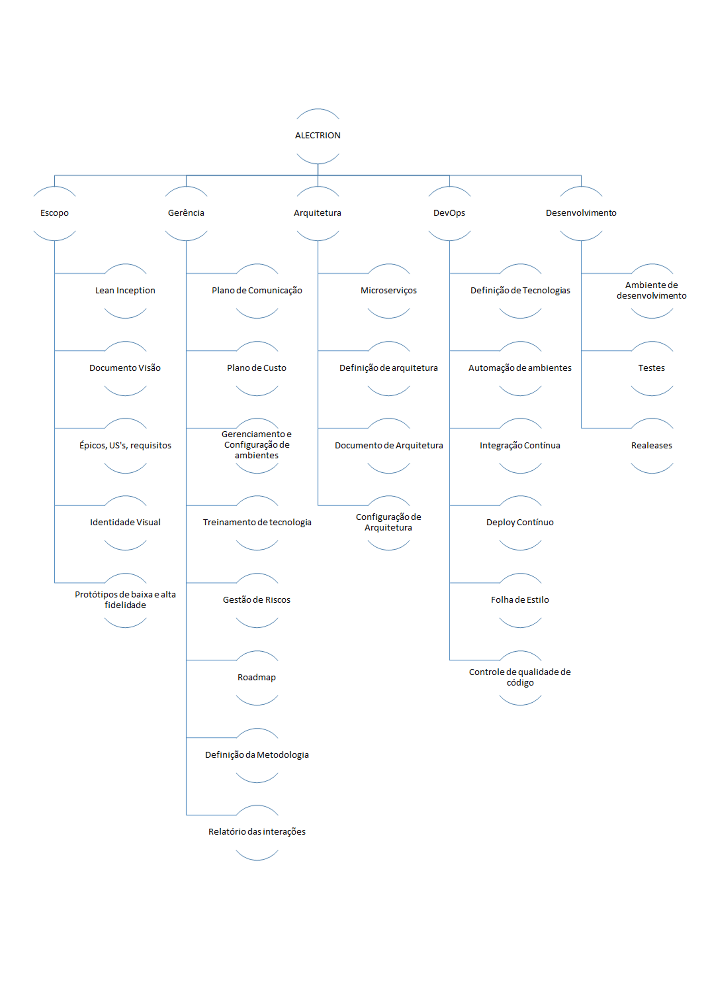

# Estrutura Analítica do Projeto

Trata-se da divisão das entregas do projeto em componentes menores e de fácil gerenciamento.

## 1. Introdução

A EAP é uma decomposição hierárquica do escopo total do trabalho a ser executado pela equipe do projeto a fim
de atingir os objetivos do projeto e criar as entregas requeridas. A EAP organiza e define o escopo total do projeto e
representa o trabalho especificado na atual declaração do escopo do projeto aprovada.

O trabalho planejado é contido dentro do nível mais baixo de componentes da EAP, que são denominados pacotes
de trabalho. Um pacote de trabalho pode ser usado para agrupar as atividades onde o trabalho é agendado, estimado,
monitorado e controlado. No contexto da EAP, o trabalho se refere a produtos de trabalho ou entregas que são o
resultado da atividade e não a atividade propriamente dita. [1]

## 2. EAP
  

## 3. Referências Bibliográficas

> [1] Referência 1. : Sexta edição.  Newtown Square, PA: Project Management Institute, 2017. Série: : Um Guia do Conhecimento em Gerenciamento de Projetos (Guia PMBOK). Disponivel em: https://dicasliderancagp.com.br/wp-content/uploads/2018/04/Guia-PMBOK-6%C2%AA-Edi%C3%A7%C3%A3o.pdf

## 4. Histórico da revisão

|**Data**|**Descrição**|**Autor(es)**|
|--------|-------------|-------------|
|30/07/2022|Criação do documento| Guilherme Leal|
