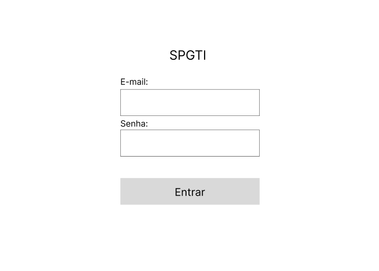
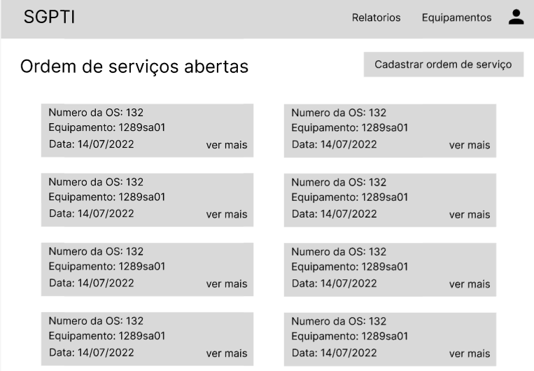
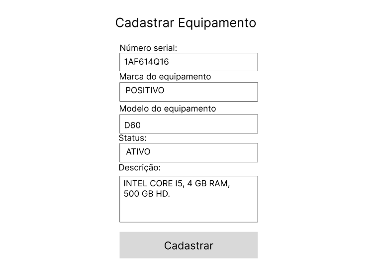

# Protótipo baixa fidelidade

 

## 1. Introdução

 

O protótipo de baixa fidelidade tem como principal objetivo validar um fluxo de trabalho que o usuário terá que realizar, focando mais nas funcionalidades e/ou na arquitetura sem se preocupar com detalhes de design. 

Este protótipo tem um intuito de obter um feedback do usuário de forma mais rápida:

 

## 2. Protótipo

 

O protótipo de baixa fidelidade foi desenvolvido na ferramenta figma, apresentado e validado com o usuário. Abaixo está ilustrado algumas das principais telas do sistema.

 

### Tela Login:

 

### Tela de Ordens de Serviços abertas:

 

### Tela cadastrar equipamento:

 

Todas as telas do protipo estão disponíveis em: 
[Figma](https://www.figma.com/file/JTsTpcNziovScbWZ1ts1q1/Untitled?node-id=0%3A1)

## 3. Referência

 

> [1] Protótipo de baixa fidelidade: o que é e como desenvolver em um projeto? Disponível em: https://www.digitalhouse.com/br/blog/prototipo-de-baixa-fidelidade/
> [2] Ferramento Figma. Disponível em: https://www.figma.com/

## 4. Histórico da revisão

|**Data**|**Descrição**|**Autor(es)**|
|--------|-------------|-------------|
|18/07/2022|Criação do documento| João Pedro Soares e Lucas Alexandre |

